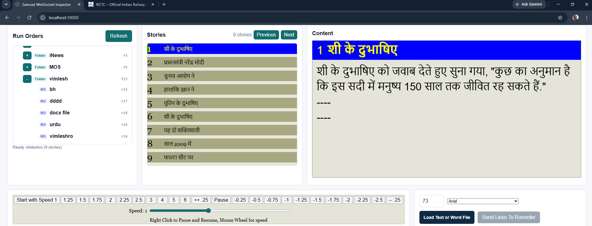

# Samvad Teleprompter Controller

Next.js controller for a Samvad Teleprompter device. The app connects to Samvad over WebSocket, reads runorders/stories, sends play controls, changes speed/font settings, and can replace the current runorder stories from a text or Word file.



## Run

Install dependencies:

```bash
npm install
```

Start the app:

```bash
npm run dev
```

Open [http://localhost:18000](http://localhost:18000).

The port comes from `.env`:

```env
PORT=18000
```

## Configuration

Create `.env` from `.env.example` and set the Samvad device details:

```env
SAMVAD_HOST=192.168.0.15
SAMVAD_HTTP_PORT=9000
SAMVAD_WS_PORT=9095
SAMVAD_HTTP_URL=http://192.168.0.15:9000
SAMVAD_WS_URL=ws://192.168.0.15:9095
SAMVAD_USERNAME=admin
SAMVAD_PASSWORD=Admin@12
PORT=18000
MAX_MESSAGES=100
INSPECT_MS=20000
SHUTTLE_PRO_ENABLED=true
```

`scripts/next-with-env-port.mjs` loads `.env` before starting Next.js, so changing `PORT` changes the local web app port.

## Technologies

- **Next.js App Router**: UI and API routes live in the `app` directory.
- **React**: Client-side controller UI in `app/page.js`.
- **Custom CSS**: Fixed 1920x1080 teleprompter-control layout in `app/styles.css`.
- **WebSocket (`ws`)**: Server-side connection to Samvad live WebSocket.
- **fast-xml-parser**: Parses Samvad XML messages into JavaScript objects.
- **mammoth**: Extracts plain text from `.docx` files before sending them to a runorder.
- **shuttle-control-usb**: Reads Contour ShuttlePRO v2 USB events directly from Node.
- **PowerShell/System.Drawing**: On Windows, `/api/system-fonts` lists installed system fonts for the font-family combo.

## Main UI

- Browse Samvad folders and runorders in the tree.
- Right-click tree items to create folders/runorders or delete items.
- Double-click a runorder to load it on the teleprompter.
- View stories in the middle column and selected story content in the right column.
- Double-click a story or type a story number then Enter to make it current.
- Control speed, play/pause, previous story, next story, font size, and whole-runorder font family.
- Load `.txt` or `.docx` files and replace all stories in the current runorder.
- Use ShuttlePRO v2 hardware controls with the same button/ring mapping style as the older teleprompter project.

## ShuttlePRO v2

This app uses direct USB events, not Chrome keyboard shortcuts. The listener runs in the local Next.js server process and sends commands directly to Samvad.

Enable it in `.env`:

```env
SHUTTLE_PRO_ENABLED=true
```

When enabled, `/api/status` starts the listener automatically. The top bar shows:

- `Shuttle connected`: a Shuttle device is detected.
- `Shuttle listening`: listener is running but no device is currently detected.
- `Shuttle off`: listener is stopped.

Manual routes are also available:

- `GET /api/shuttle/status`
- `POST /api/shuttle/start`
- `POST /api/shuttle/stop`

### Shuttle Mapping

Buttons:

| Button | Action |
| --- | --- |
| 1 | Play/Pause |
| 2 | Speed `-2.5` |
| 3 | Speed `-1` |
| 4 | Load first story and play from start |
| 5 | Speed `1` |
| 6 | Speed `1.25` |
| 7 | Speed `1.5` |
| 8 | Speed `1.75` |
| 9 | Increase speed by `0.25` |
| 10 | Go to story `5` |
| 11 | Go to story `10` |
| 12 | Go to story `15` |
| 13 | Go to current story + `5` |
| 14 | Previous story |
| 15 | Next story |

Jog:

| Jog | Action |
| --- | --- |
| Left | Speed `-1` |
| Right | Speed `1` |

Shuttle ring:

| Position | Speed |
| --- | --- |
| `-7` | `-2.5` |
| `-6` | `-2.25` |
| `-5` | `-2` |
| `-4` | `-1.75` |
| `-3` | `-1.5` |
| `-2` | `-1.25` |
| `-1` | `-1` |
| `0` | Pause |
| `1` | `1` |
| `2` | `1.25` |
| `3` | `1.5` |
| `4` | `1.75` |
| `5` | `2` |
| `6` | `2.25` |
| `7` | `2.5` |

## APIs

All routes return JSON. Success responses normally include `ok: true`; errors include `ok: false` and `error`.

### Status And Inspection

`GET /api/status`

Returns current WebSocket state, target URL, latest message, message count, and auth state.

`GET /api/messages`

Returns recent parsed WebSocket messages. Controlled by `MAX_MESSAGES`.

`POST /api/reconnect`

Closes and reconnects the Samvad WebSocket client.

### ShuttlePRO

`GET /api/shuttle/status`

Returns Shuttle listener state, connected devices, last hardware event, last Samvad action, and the active mapping.

`POST /api/shuttle/start`

Starts the ShuttlePRO listener manually, even if `SHUTTLE_PRO_ENABLED` is not set.

`POST /api/shuttle/stop`

Stops the ShuttlePRO listener.

### Runorder Tree

`GET /api/folders`

Loads the root folder tree.

`POST /api/folders`

Loads a folder subtree.

```json
{
  "parentID": "f1",
  "parentSlug": "root",
  "refresh": true
}
```

`POST /api/folder-create`

Creates a folder under a parent folder.

```json
{
  "name": "New Folder",
  "parentID": "f1"
}
```

`POST /api/runorder-create`

Creates a runorder under a parent folder.

```json
{
  "name": "Morning Rundown",
  "parentID": "f1"
}
```

`POST /api/item-delete`

Deletes a folder or runorder item.

```json
{
  "itemID": "DDNRCS_RO",
  "itemSlug": "Morning Rundown",
  "itemType": "runorder"
}
```

`POST /api/runorder-show`

Loads a runorder on the teleprompter, similar to Samvad's ready-to-play action.

```json
{
  "roID": "DDNRCS_RO",
  "roSlug": "Morning Rundown"
}
```

### Stories

`GET /api/stories`

Returns stories from the current runorder, including story id, title, raw content, plain content, and rendered preview HTML.

`POST /api/story-play`

Makes a story current on the teleprompter.

```json
{
  "storyID": "story-1",
  "storySlug": "Opening Headlines"
}
```

`POST /api/runorder-content`

Replaces the stories in the current runorder from pasted/uploaded text. The UI sends one story per line or paragraph.

```json
{
  "mode": "lines",
  "html": "Story one\nStory two\nStory three"
}
```

### Teleprompter Controls

`POST /api/control`

Sends a control command.

```json
{
  "command": "Play"
}
```

Known commands used by the app:

- `Play`
- `Pause`
- `Skip`
- `Previous`
- `Up`
- `Down`

`POST /api/speed`

Sets scroll speed. Positive values send forward direction; negative values send reverse direction using Samvad's direction control.

```json
{
  "speed": 1.5
}
```

`POST /api/font-size`

Sets teleprompter font size.

```json
{
  "fontSize": 96
}
```

`POST /api/font-family`

Applies a font family to every story in the current runorder.

```json
{
  "fontFamily": "Arial"
}
```

`GET /api/system-fonts`

Returns installed fonts from the machine running the Next.js server.

### Experimental/Legacy Routes

These routes still exist for testing Samvad behavior, but the main UI no longer shows their controls:

- `POST /api/story-content`: sends content to the current story.
- `POST /api/colors`: sends foreground/background color sync test data.
- `POST /api/alternate-color`: toggles alternate color sync test data.
- `POST /api/text-direction`: experimental Urdu/RTL visual-order conversion.

## Samvad Protocol Notes

The app sends and receives Samvad XML wrapped in `<PCSyncPlay>`.

Example login:

```xml
<PCSyncPlay>
  <Login>
    <UserName>admin</UserName>
    <PassWord>Admin@12</PassWord>
    <LogoutFromOtherSystem>false</LogoutFromOtherSystem>
  </Login>
</PCSyncPlay>
```

Example speed:

```xml
<PCSyncPlay>
  <Speed>
    <roID>DDNRCS_RO</roID>
    <CurrentSpeed>1.5</CurrentSpeed>
    <MaxSpeed>20</MaxSpeed>
  </Speed>
</PCSyncPlay>
```

Example direction:

```xml
<PCSyncPlay>
  <Control>
    <roID>DDNRCS_RO</roID>
    <Status>Down</Status>
  </Control>
</PCSyncPlay>
```

## Build

```bash
npm run build
npm start
```

`npm start` also reads `PORT` from `.env`, so production starts on [http://localhost:18000](http://localhost:18000) with the current configuration.
